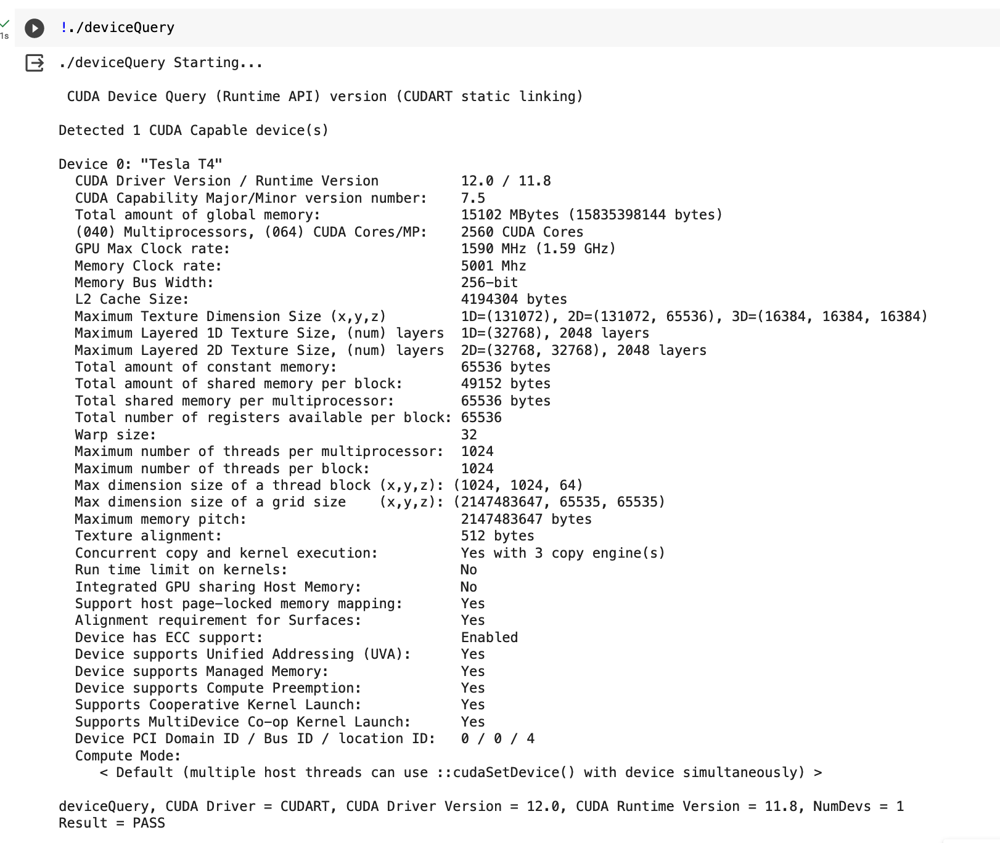
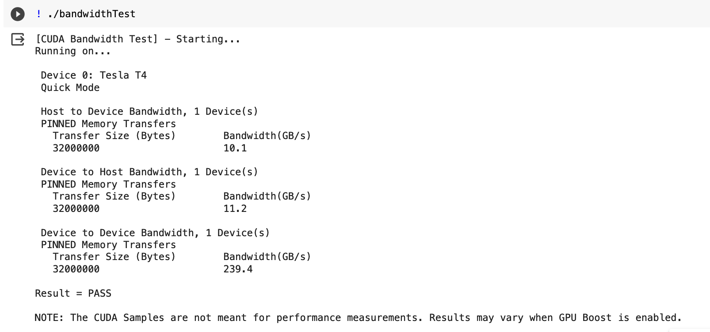
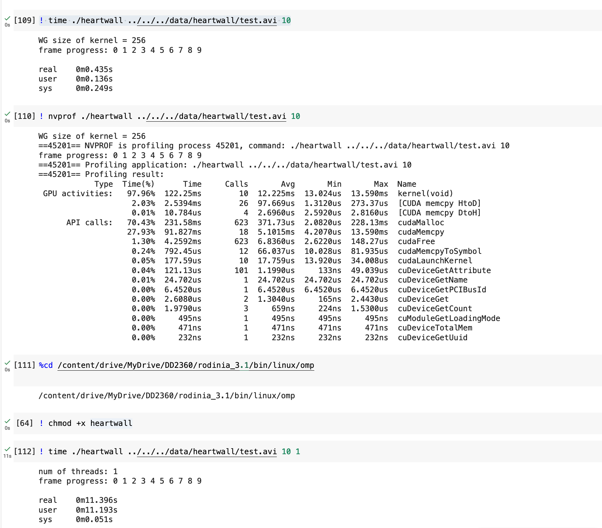
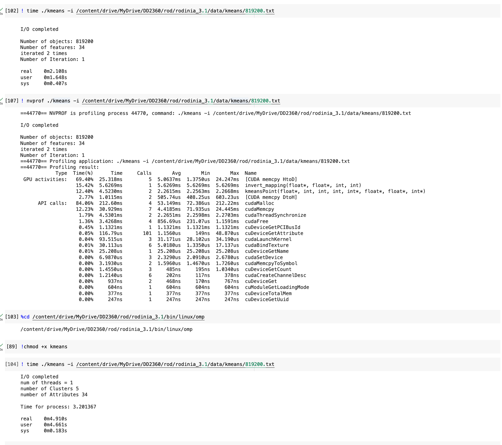
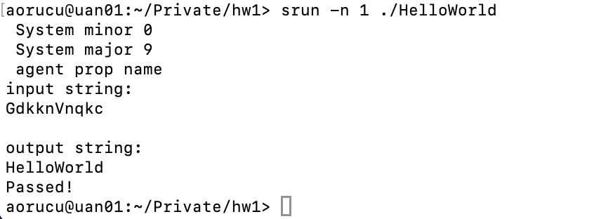

# Assignment 1

## Exercise 1 - Reflections on GPU-accelerated Computing

### 1
- CPUs are faster and better at handling complex instructions
- GPUs have a lot more cores which means they can work on a lot of tasks in parallel

### 2 

| Rank | Name | GPU model | Rpeak / Power (TFlops/kW) |
|---|---|---|---|
| 1 | Frontier | AMD Instinct MI250X | 73.95 |
| 2 | Fugaku | Fujitsu A64FX | 14.78 |
| 3 | LUMI | AMD Instinct MI250X | 51.36 |
| 4 | Leonardo | Nvidia Ampere A100 | 32.14 |
| 5 | Summit | Nvidia Tesla V100 / Volta GV100 | 14.66 |
| 6 | Sierra | Nvidia Tesla V100 / Volta GV100 | 12.64 |
| 7 | Sunway TaihuLight | - | 6.05 |
| 8 | Perlmutter | Nvidia Ampere A100 | 27.04 |
| 9 | Selene | Nvidia Ampere A100 | 23.81 |
| 10 | Tianhe-2A | Matrix-2000 | 3.30 |

- 9 out of 10 have a GPU
- Out of those 5 are by Nvidia 2 by AMD and one each from Fujitsu and Matrix
- source: https://www.top500.org/lists/top500/2023/06/

## Exercise 2 - Query Nvidia GPU Compute Capability

The compute capability is 7.5.

- Memory Clock rate: 5001 Mhz
- Bus width: 256-bit
- DDR: 2
- Memory bandwith: 5001 * 256 / 8 / 1024 * 2 = 312 GB/s

The bandiwth from the test is lower than the value calculated.

## Exercise 3 - Rodinia CUDA benchmarks and Comparison with CPU

In both images provided the results on the top are on a GPU and on the bottom on one thread using OpenMP. The programs executed on CUDA is faster ann both of the programs - heartwall and k-means. These tasks are imaging and data mining tasks which can be done in parallel. For this reason GPU performs it muchs faster.

## Exercise 4 - Run a HelloWorld on AMD GPU

To launch the code on the AMD GPUs in Dardel. First, one needs to get a GPU allocation. Then the executable created can be launched on the GPU using the `srun` command and specifying which node the program should run on with the `-n` flag.

